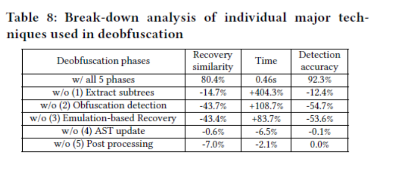
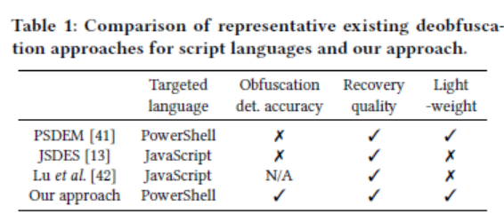
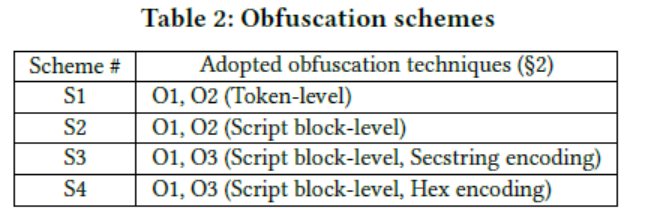
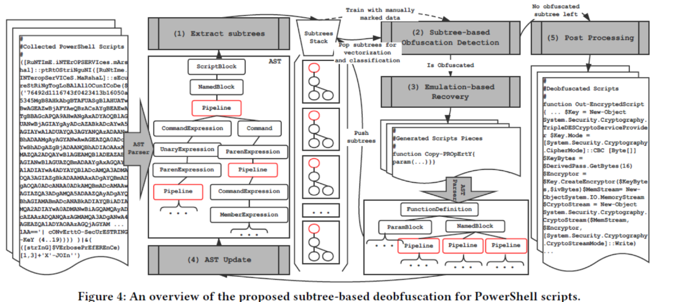
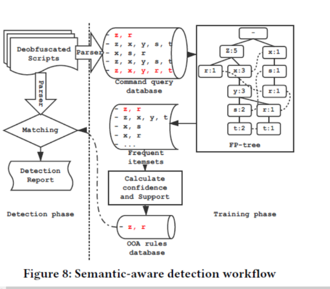
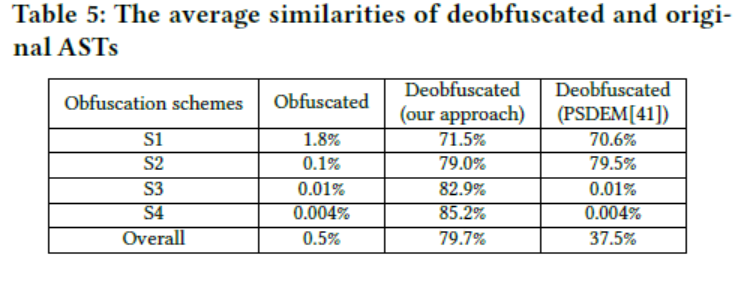
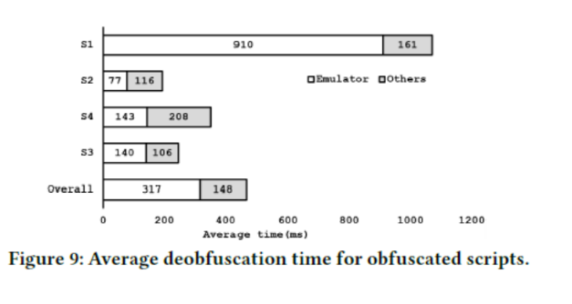

OTC 7TH,2019

------

# Effective and Light-Weight Deobfuscation and Semantic-Aware Attack Detection for PowerShell Scripts

作者：Zhenyuan li, Qi Alfred Chen, Chunin Xiong，Yan Chen, Tiantian Zhu,Hai Yang

单位：Zhejiang University, University of California, Irvine  MagicShield Inc

出处：Generic, Efficient, and Effective Deobfuscation and Semantic-Aware Attack Detection for PowerShell Scripts

资料：<u>Pdf</u>

------

## Abstract 

Powershell攻击出现在越来越多的高级持续性威胁，勒索软件，网络钓鱼邮件，加密劫持，金融威胁，无文件攻击的网络攻击中。而且Powershell语言是动态设计的，是在不同的层次上构建脚本片段的，并且目前最先进的静态分析的Powershell攻击检测方法本质上容易模糊。

为了克服这一问题，作者设计了一个有效的轻量级Powershell脚本去模糊方法。同时，为了解决精确识别可恢复脚本片段的难题，作者设计了新奇的基于子树的去模糊方法，该方法在powershell脚本抽象语法树的子树级执行模糊检测和基于仿真的恢复。

在以上基础上，作者进一步设计了第一个语义感知的Powershell攻击检测系统。利用经典面向对象关联挖掘算法识别出31个Powershell攻击的语义特征，对2342个良性样本和4141个恶意样本进行评估。去模糊方法所用时间平均不到0.5秒，说明该方法是既有效又轻量的。在去模糊的应用下，发现Windows Defneder 和Virustotal的攻击检测率分别从0.3%和2.65%大幅度提高到75%和90%,且语义感知攻击检测系统以平均92.3%的真阳率和0%的假阳率优于Windows Defenderr和Virus Total。

**********************************************************************

## 1.INTRODUCTION

Powershell是具有面向对象的动态类型脚本语言的管理脚本工具，由于它预先安装在大多数windows计算机上，可以直接访问特权系统功能，也可以直接从内存被执行，因此它是完全无文件的，这就是攻击者认识到Powershell作为攻击向量的优势的原因。

最先进的Powershell攻击检测方法主要使用静态分析匹配字符串级签名（比如手工挑选、利用机器学习算法）来对抗以上提到的威胁。与基于动态分析的方法相比，基于静态的分析方法实际上更有效也有着更高的代码覆盖率，但是自从Powershell的语言是动态设计并且可以建造了不同层次的脚本片段，这些现有的方法本质上极易被模糊。

表1显示在模糊检测精度、恢复质量和开销方面代表性的现有去模糊方法的比较。

- PSDEM[41]方法中作者手动检测了Powershell去模糊方法，然后分别为每种技术设计有针对性的去模糊方法，但是它不能覆盖未知的模糊技术并且在模糊检测中有很高的误报率；
- JSDES[13]方法专门对JavaScript中的基于函数的模糊执行去模糊处理，因此不能检测到仅仅通过基础操作而不是函数完成的模糊处理；
- Lu et al.[42]建议通过动态分析和程序切片（**program slicing**)去模糊JavaScript代码,由于依赖动态检测，它不需要检测模糊，但是它的恢复具有有限的代码覆盖率，并且比静态分析（比如PSDEM)要轻量级；

*********************

## 2.Problem Statement

### 部署模型：

关键见解：模糊的脚本语言的通用属性是：在运行执行时模糊的脚本片段必须恢复到原始的、非模糊的脚本片段，然后才能执行。因此，对于一个模糊的脚本，只要所有的模糊脚本片段对和恢复逻辑能够被确定，就可以模拟每对的恢复过程，从而逐步地重构整个原始脚本。然而，关键是怎样精确地识别称之为可恢复脚本片段地这些对，如果这样地识别不够精确，那么直接执行脚本片段无法触发恢复过程，因此只能通过中间脚本恢复结果或脚本执行结果。

### 设计：

- 提出一种新的基于子树的去模糊方法，在PowerShell脚本的抽象语法树（Abstract Syntax Tree(AST))的子树级来执行模糊检测，AST是PowerShell的最小模糊单元。
- 由于典型的几千字节的脚本已经有上千个子树，为了达到较高的去模糊效率，设计了一种基于机器学习的识别器，首先对给定的模糊子树分类。
- 对于模糊的脚本，在AST中从底向上遍历他们来识别可以恢复的脚本片段并模拟恢复逻辑，从而最终构建整个去模糊化的脚本。
- 由于设计的去模糊化方法可以揭漏PowerShell脚本的语义，基于此进一步设计语义感知的Powershell攻击检测系统。在系统设计中，采用经典面向对象关联挖掘算法（**Objective-oriented Association(OOA)mining algorithm**)，能够自动提取频繁出现的命令和函数集（OOA规则），进行语义特征匹配。
- 为了评估PowerShell的去模糊化方法和攻击检测系统，对在GitHub前500存储库收集2342个良性脚本样本和从安全博客，攻击分析白皮书，开源攻击存储库收集的4141个恶意样本进行实验。

### 设计实现：

- 利用模糊化从根本上限制了当前PowerShell攻击检测的有效性这一观点，为PowerShell脚本设计了第一个有效且轻量级的去模糊化方法。为了解决精确识别可恢复脚本片段的难题，设计了新的基于子树的去模糊化方法，可以在PowerShell脚本AST的子树级别执行模糊化检测和基于仿真的恢复；
- 在新的去模糊化方法的基础上，设计第一个语义感知PowerShell攻击检测系统；为了实现基于语义的检测，采用OOA挖掘算法来获取PowerShell攻击签名，并基于恶意PowerShell脚本数据库集合新识别31个PowerShell攻击OOA规则。
- 基于收集的6483个PowerShell脚本样本（2342个良性样本和4141个恶意样本),作者实现的去模糊化方法有效且将模糊脚本和原始脚本的相似度从0.5%提高到80%左右。对于平均大小为5。4千字节的脚本所用时间平均不到0.5秒。
- 通过应用去模糊化的方法，Windows Defender和VirusTotal的攻击检测率从0.3%和2.65%显著提高到75.0%和90.0%。
- 语义感知攻击检测系统以平均92.3%的真阳性率和0%的假阳性率优于Windows Defender和VirusToal。

****

## 3.Background

##### PowerShell作用：

- 用作攻击向量
- 用于下载和有效负载执行
- 建立反向shell并在目标机器上收集信息

##### 通过PowerShell的无文件攻击

*无文件攻击指避免在磁盘上留下任何攻击的痕迹。*

##### PowerShell成为此类攻击理想工具的原因：

- 自Windows 7和Window Server 2008 R2以来，所有Windows计算机上都预装了PowerShell。
- PowerShell可以方便地访问所有主要window组件，包括windows管理规范（**WMI**)和组件对象模型（**COM**),可以直接触发许多特权系统级别。
- PowerShell脚本可以直接从内存中执行，无需任何形式地隔离，从而可以避免磁盘上的恶意文件，绕过传统的基于文件的防御方法。

##### PowerShell的模糊化方法

- 随机混淆

  对脚本进行随机更改而不影响其执行和语义

- 字符串混淆

  字符串拆分、字符串反转、字符串重新排序等等，涉及到"$StrReorder", "$Strjoint"和"$Url"

- 编码混淆

  是最常见的混淆技术，编码后的脚本反映了原始脚本的少量信息

##### 五种代表性的PowerShell混淆方案

警报数：S3\S4>S1>S2

S2的混淆处于令牌级，隐藏恶意行为比S3更细粒度；对于S3和S4的编码混淆防病毒引擎会报告警报；混淆可以用于知识产权和避免不必要的更改，但是这种启发式可能导致误报，所以大多数反病毒不会使用Table2的启发式

****

## 4.Overview

##### 检测过程分为三个阶段：

- 模糊化阶段

  利用PowerShell脚本特征的基于子树的方法，将AST子树作为模糊的最小单元，在子树上执行恢复，然后建立去模糊化脚本；

- 训练和检测阶段

  经过上一阶段，恶意PowerShell脚本语义公开，采用恶意PowerShell脚本数据库上的挖掘算法，自动提取31个OOA规则进行数字匹配；此外，采用现有的反病毒引擎和手动分析作为扩展；

- 应用程序

  将以上方法运用到应用程序中，比如：实时攻击检测、大规模自动恶意软件分析；

****

## 5.方法

##### 1.基于子树去模糊化方法

分为五个阶段：

- 提取可疑子树

  *可疑子树：PipelineAst类型的子树根或AssignmentStatementAst节点下的第二子树*

  采用Microsoft 的官方图书馆 的系统管理自动化语言（System.Mangement.Automation.Language),来分析PowerShell脚本得到AST;以广度优先的方式遍历AST,并将可疑子树送到堆栈以进行后续步骤。

- 基于子树的模糊化检测

  使用二进制识别器对已识别的子树来寻找模糊化的子树。

  筛选特征：

  - 脚本片段熵

    *熵代表字符频率的统计特性*

    计算公式为：

    

    *Pi代表第i个字符的频率*

  - token的长度

    选取平均值和最大长度作为特征

  - AST类型的分布

    计算每种节点的节点数，并构造一个71维向量作为特征

  - AST的深度

    使用AST的深度和节点总数作为特征

- 基于仿真的恢复

  建立PowerShell执行会话，执行模糊化片段在最后一步；如果是可恢复的脚本派那段，这个过程返回恢复的脚本片段；如果返回值不是字符串，意味着最后一步的模糊检测结果要么是错的，要么现行的脚本片段是不可恢复的片段。

- 更新AST

  两个阶段：一、用恢复后的子树代替可恢复的子树，更新所有祖先特征，并将恢复的子树中的所有子树推送到堆栈中；二、更新脚本片段的更改。

- 后处理

  经过重建，得到于原先脚本有相同语义的脚本。但是与原先脚本仍有些不同，模糊处理过程中会引入额外的标记以及圆括号，在后处理阶段，这些语法级别的更改使用正则表达式定位，并相应的修复。

  ****

  ****

##### 2.语义感知的PowerShell攻击检测

*采用API集而不是图形来进行PowerShell的语义检测*

- 训练阶段

  使用FP-growth算法生成频繁模式，然后选择满足支持度（support)和可信度(confidence)大于用户指定的规则的模式。

​                    

​               

- 检测阶段

  将去模糊化的脚本解析为项集，并尝试匹配预先训练的OOA规则。

****

## 6.评价

方法：

- 评估基于子树的去模糊化的表现

1.是否发现模糊处理所涉及的最小子树，直接决定了模糊处理的质量；

2.比较去模糊化脚本和原始脚本的相似性来验证整个模糊处理的质量；

3.通过计算不同模糊处理方法对脚本进行去模糊处理所需的平均时间来评价脚本的去模糊处理效率；

- 去模糊化方法在PowerShell攻击检测的优势
- 评价结果

1.模糊化检测准确性

结果如图，因为正则表达式只能用来定位模糊处理中的常用函数，而不能确定函数适用于模糊处理还是用于常规场景，说明了基于正则表达式的模糊处理检测的固有局限性。

2.恢复质量

S2\S3\S4这三种方案都是基于脚本块的，能够在去模糊化后完全保留脚本块内部的结构，从而获得更高的相似度。

3.去模糊化效率

Emulator的工作是撤销混淆；Other主要是ast的重建和脚本的恢复；

对于基于编码的混淆，仿真器需要解码比基于字符串的混淆的字串连接速度慢。Emulator为基于token的模糊化脚本花费更多的时间，因为它们包含更多的模糊化子树。

4.基于去模糊化脚本的攻击检测

去模糊化能够显著提高检测效率，基于语义的检测也有很好的效果，意味着对去模糊化脚本进行语义分析是可行的。

5.先进的PowerShell检测方法的比较

混合脚本可以大大降低基于AST和基于字符检测方法的真实阳性率，但是不会影响Our approach.

6.在去模糊化中使用技术的分解解析

结果如图

****

## 7.最后

作者实现了对PowerShell脚本去模糊化的方法，说明了可以获取计算机上越来越多的操作信息方法的多样性，对于要恢复的模糊化脚本片段来言是一大幸事；但是我们要警醒，此方法导致脚本可去模糊化是否对特权系统权限的获取有可能性，所以如何达到完全已知脚本的情况下，但又能较好的保护系统呢？

